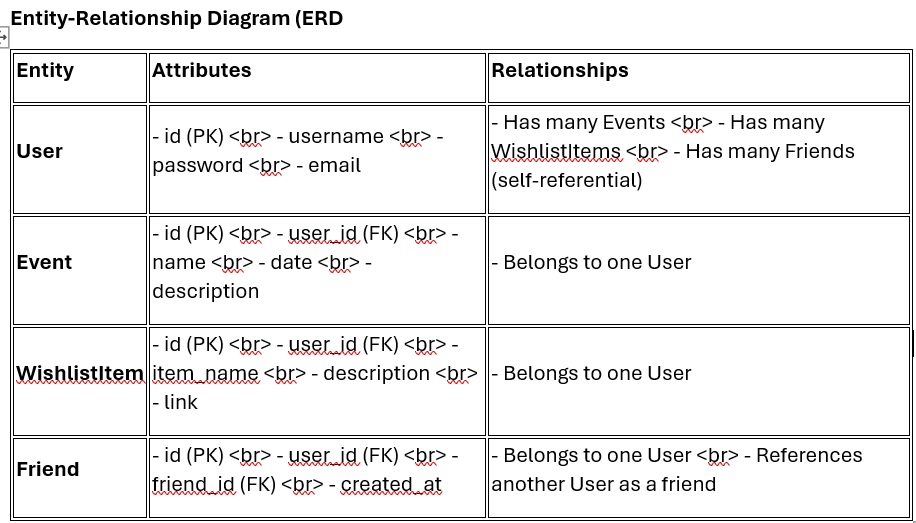
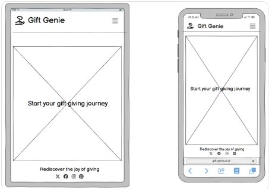
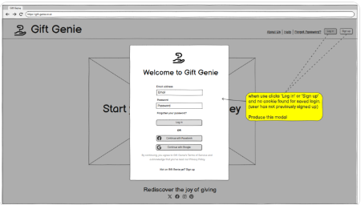

# Gifting Genie - A Gift Giving Alert System
Created by: Phillip Kershaw, Christopher Matthew, Geraldine Edwards and Joanna O'Connor. 

link to Heroku (live page)
> [View live project here]()

Github link 
> [view Github repo here](https://github.com/Philgck/gifting-genie-two)
> 

Gifting Genie is a dynamic and intuitive gifting management web application designed to help authenticated users manage their events and wishlist items, and connect with their friends to share and view profiles. Built with HTML, CSS, JavaScript, and Django, this app aims to streamline the process of organizing events, tracking desired gifts, and maintaining connections with friends, all in one place. Whether planning a birthday party, keeping track of gift ideas, or checking a friend's wishlist, Gifting Genie makes the experience seamless and enjoyable. Gifting Genie simplifies the process of managing gift lists and events while maintaining a social network of friends to share and celebrate with.

**Overview**

**Key Features:**
**User Authentication:** Secure login and registration system to ensure user data privacy and personalized experience.
**Event Management:** Allows users to create, update, view, and delete events, complete with a calendar interface for date selection and event naming.
**Wishlist Management** Users can compile and manage a list of desired gifts, including item descriptions and purchase links.
**Friends List:** Users can add friends (other authenticated users), view their profiles, and see their events and wishlists, fostering a social aspect to gift-giving.
**CRUD Functionality:** Full Create, Read, Update, and Delete operations are supported across all models, providing flexibility and control to the users.

**Models and Relationships:***
**User:** Utilizes Django's built-in User model for handling authentication and user-related data.
**Event:** Links to the User model, allowing users to manage their events.
**WishlistItem:** Links to the User model, enabling users to manage their wishlist items.
**Friend:** Establishes a self-referential relationship within the User model, allowing users to connect and interact with friends.

**Technical Stack:** 
**Front-End:** HTML, CSS, and JavaScript provide a responsive and user-friendly interface.
**Back-End:** Django handles the server-side logic, including database management and API development.
**Database:** Utilizes PostgreSQL to store and manage user data, events, wishlist items, and friendships.
**Deployment:** Configured for deployment on Heroku for accessibility and scalability.

---
> 

>
---

## CONTENTS

 - [User experience (UX)](#user-experience)
     - database planning
     - purpose and intended audience		 
     - user stories
 - [Creation process](#creation-process)
     - [Wireframes](#wireframes)
 - [Design](#design)
     - Colour scheme
     - Typography
     - Imagery
 - [Website features](#website-features)
 - [Tablet/mobile view](#tablet/mobile-view)
 - [Future features](#future-features)
 - [Technologies used](#technologies-used)
 - [Ai Augmentation](#ai-augmentation) 
 - [Deployment](#deployment)
 - [Testing](#testing)
 - [Credits](#credits)
 ---
 ## Gifting-Genie USER EXPERIENCE
 ---

**User Model**
The User model is the standard Django Allauth model

**ERD of models Gifting-Genie**

 

**Purpose and Intended Audience of Gifting-Genie**

PURPOSE
Gifting-Genie is designed to simplify and enhance the experience of managing events, gift wishlists, and social connections. Its primary goal is to provide users with an efficient, user-friendly platform to keep track of important dates, desired gifts, and their network of friends. By integrating event management, wishlist tracking, and friend interactions in a single application, Gifting-Genie aims to make gift-giving and event planning more organized and enjoyable.

INTENDED AUDIENCE
- Gifting-Genie caters to a diverse audience, including:
- ndividuals: Anyone looking to manage their personal events, keep a list of gift ideas, and connect with friends to share and view wishlists and event details.
- Families and Friends: Groups of users who want to coordinate gift-giving and event planning within their social circles, ensuring everyone is on the same page for special occasions.
- Event Planners: Professionals or enthusiasts who need a reliable tool to organize events, track important dates, and manage guest lists and gift registries.
- Communities and Clubs: Social groups and organizations that want to maintain a shared calendar of events and coordinate gift exchanges among members.

By addressing the needs of these varied user groups, Gifting-Genie aims to create a cohesive and interactive experience that brings people together through thoughtful event planning and gift-giving.

**Gifting-Genie User stories**
		 
Title | User story | MoSCoW prioritisation |
--- | --- | --- |
**Account Registration** | As a **site user** I want to **register an account** so that I can **login and access my personalized dashboard.** | Must have |
**User Login** | As a **registered user** I want to **log in to my account =** so that I can **access my events, wishlist, and friends list.** | Must have |
**Event Creation** | As a **registered user** I want to **create events** so that I can **manage my schedule and important dates.** | Must have |
**Add Wishlist Item** | As a **registered user** I want to **add items to my wishlist** so that I can **keep track of gifts I want to receive.** | Must have |
**Edit Profile** | As a **registered user** I want to **edit my profile** so that I can **update my personal information.** | Must have |
**Delete Event** | As a **registered user** I want to **delete an event** so that I can **remove it from my calendar.** | Must have |
**Add Friends** | As a **registered user** I want to **add friend** so that I can **view their events and wishlist, and they can view mine.** | Should have |
**View Friend's Profile** | As a **registered user** I want to **view my friend's profile** so that I can **see their events and wishlist.** | Should have |
**View Friend's Profile** | As a **registered user** I want to **view my friend's profile** so that I can **see their events and wishlist.** | Could have |

  
We used [GitHub Projects](https://github.com/Philgck/gifting-genie/projects?query=is%3Aopen) to create a project board and populated it with user stories and added labels according to MoSCoW prioritisation.
All of the 'must have' user stories ###### are/were not completed ~~with any other issues being carried over to the next sprint of the project development.~~

Each user story had acceptance criteria added.The fulfillment of the criteria for each of these can be demonstrated by the presence of the features on the site (see below). The CRUD funtionality of the 'Event', 'Wish List' and 'Friends' models were tested extensively throughout each development phase both manually and through automated unit tests. 

---

**Gifting-Genie SITE USER GOALS**
- Efficient Event Management:
 - Users want to easily create, update, and delete events for important occasions.
  - Users aim to view a comprehensive list of their upcoming events and associated details.
- Streamlined Gift Management:
  - Users want to add, update, and delete items in their wishlist.
  - Users aim to view and manage a consolidated list of desired gifts with links for easy access.
- Social Connectivity:
  - Users want to add friends and view their profiles.
  - Users aim to see their friends' events and wishlists to stay informed.
- Personalized User Experience:
  - Users want to edit their profile information to keep it up-to-date.
  - Users aim to receive personalized notifications and updates about their events and friends' activities.
- Privacy and Security:
  - Users want to ensure their personal data is secure.
  - Users aim to manage their privacy settings for who can view their profile and content.

**Gifting-Genie SITE-OWNER GOALS**
- User Engagement:
  - Site owners want to increase user registration and activity on the platform.
  - Site owners aim to keep users engaged with regular updates and new features.
- Platform Maintenance:
  - Site owners want to ensure the application runs smoothly without downtime.
  - Site owners aim to regularly update the app with bug fixes and performance improvements.
- Data Analytics:
  - Site owners want to collect and analyze user data to improve the app's features.
  - Site owners aim to use analytics to understand user behavior and preferences.
- Security Compliance:
  - Site owners want to comply with data protection regulations.
  - Site owners aim to implement robust security measures to protect user data.
- Community Building:
  - Site owners want to foster a strong community of users.
  - Site owners aim to create engagement opportunities such as forums, newsletters, and social media integration. (FUTURE FEATURE)

## CREATION PROCESS

  ### Wireframes
Wireframes were created using...............

Landing page wireframe desktop view 

Landing page view for tablet and mobile devices

Registration page view wireframe

---

## DESIGN

### Typography

The website uses the following fonts:

- **Arial**: The primary font used throughout the website for its clean and professional appearance. Arial is a widely available sans-serif font that ensures readability and consistency across different devices and browsers.

### Colour Scheme

The color scheme of the website is designed to provide a clean, non-intrusive background that is easily viewed in both light and dark modes. This design choice follows a style often used by information and education sites, such as Wikipedia. The primary colors used are:

- **Black and White**: The almost black and white color scheme provides a neutral background that does not distract from the content. This ensures that the text is easily readable and the images stand out.
- **Accent Colors**: 
  - **Blue (#005eff)**: Used for links, buttons, and other interactive elements to draw attention without being overwhelming.
  - **Green (#28a745)**: Used for positive actions such as the "Add Comment" button.
  - **Yellow (#ffc107)**: Used for the "Return Home" button to provide a bright, noticeable call to action.
  - **Red (#e0a800)**: Used for hover states to indicate interactivity.

The palette was chosen using [Coolors](https://coolors.co/).

### Imagery
- **DALL·E**: AI-generated images via Chat GPT that provide unique and creative visuals for the blog posts. 
- **Pixabay**: Royalty-free stock images that are used to complement the content. [Pixabay](https://pixabay.com/)

The 'Gifting Genie' icon is used as the icon to enhance the visual appeal and usability of the website. The same icon is included both on each page in the Navbar and as a recognisable icon as the favicon for the tab. [Procreate](https://procreate.com/)

### Layout and Styling

The website features a consistent layout and styling across all pages, ensuring a cohesive user experience. Key design elements include:

- **Header**: The header contains a collapsible navbar that is consistent across all pages. It includes links to the main sections of the website, such as ~~Home, Nuclear Facilities, Nuclear Fuel & Waste, Nuclear Defence, Nuclear Power in Space, Fact or Fiction, and Educational Resources.~~ The navbar also includes login and signup links for unauthenticated users and a logout button for authenticated users.
- **Collapsible Navbar**: The navbar is designed to be responsive and collapses into a hamburger menu on smaller screens. This ensures that the navigation is accessible and user-friendly on all devices.
- **Footer**: The footer is consistent across all pages and includes links to social media apps Facebook, X (formerly Twitter) and Instagram. It maintains the same styling as the header, providing a cohesive look and feel across all pages.
- **Main Content Area**: The main content area is designed to be flexible and accommodate various types of content, including text, images, and interactive elements. It is styled to ensure readability and a pleasant user experience.
    
 ---

## WEBSITE FEATURES 

  **LANDING PAGE VIEW**
  

  
landing page

  

  

  Users arrive directly on the landing page which outlines the purpose of the app immediately rather than requiring users to log in or register before being able to see anything in order to entice users to then sign-up in order to use the features.

 

**USER AUTHENTICATION**

  
Authentication page

  
   

  Users must be registered via the sign up page and/or login to navigate from the landing page to their user profile. The login page/sign up notice will pop up if the user is not logged in when the landing page is clicked. Incomplete fields will receive prompts. 

**USER PROFILE VIEW** 
  

  
User Profile Page

  
 
  

  Authenticated users then access their calendar to add, view or edit events; add, view or modify wishlists, and view or modify their friends list from their own user profile. 
  
 
    
  **EVENTS DETAILED VIEW**
  

  
Calendar of events

  

  

  The detailed view a calendar containing user added events.

   

  **WISHLIST VIEW**
  

  
A populated wishlish example

  

  

  Each user-associated wishlist contains user-added items. Users can edit/delete items on their wishlist. 
  

  -->

**FRIENDS LIST VIEW**
  

  
Example associated Friends List

  

  

  Each user-associated wishlist contains user-added items. Users can edit/delete items on their wishlist. 
  
  -->

**FRIENDS USER PROFILE VIEW**
  

  
A view of a friend's profile

  

  

  Each user can view selected friends' profiles and view their events and wishlists.  
  

  -->

  **CUSTOMISED ADMIN PANEL**
  

  
Admin Panel

  

  

The admin panel, a feature of Django, was customized using Summernote to enhance the styling of the ~~topics. A filter panel function was added to distinguish between published and unpublished topic-blogs. Additionally, a 'category' selector was integrated into the 'create topic' view to ensure new topic-blogs are assigned to the appropriate topic-page.~~

 

 ---

## FUTURE FEATURES
The following would be options to consider including in future versions of the website:
 
  - Include a 'Search Events' feature for users to search for events using search keywords that navigates user to the event details from the search results.
  - Include a 'Search Friends' feature where friends can be searched for by username
  - Include a 'Share invite to Friends' feature to link authenticated users with their family and freiends
  - Users can select items on a friend's wishlist to indicate intended purchase so that both the friend and other viewers of the wishlist can identify available items. 
    - Requested friends can receive notifications (via a preferred method eg email or in-app) when other users edit their wishlist to indicate intention of purchase. 
  - Friends can receive notifications (via a preferred method eg email or in-app) that another friend has created a new event or wishlist. 
    

## TECHNOLOGIES USED

  ### Languages Used ######

### Frameworks, Libraries, and Programs Used

 ---

### AI AUGMENTATION 
## Leveraging AI Tools for Code Creation ##
<!-- During the development of the 'Nuclear Knowledge' nuclear physics blog app, I utilized GitHub Copilot to assist in code creation. Copilot provided valuable code snippets and suggestions that accelerated the development process. Key areas where AI was used include:
- Generating Views and Templates: Copilot was instrumental in generating Django views and HTML templates. For instance, the initial structure of views such as nuclear_facilities, nuclear_fuel_waste, and nuclear_defence were generated using Copilot. These snippets provided a solid foundation, which I then manually checked and modified to fit the project's specific requirements.
 - Form Handling: Copilot assisted in creating forms for user input, such as CommentForm and TopicForm. The generated code snippets were reviewed and adjusted to ensure they met the application's validation and processing needs.
 - File and Directory Management: Copilot was invaluable in reminding me of the numerous files and directories to amend when new models, views, or features were introduced, ensuring that all the correct files were updated.
While Copilot provided a significant boost in productivity, it was essential to manually review and modify the generated code to ensure accuracy and alignment with project requirements. -->

- AI-Assisted Debugging
<!-- GitHub Copilot played a crucial role in identifying and resolving bugs. Key interventions include:
  - Error Handling: Copilot suggested error handling mechanisms for views and forms. For example, it provided initial code for handling form validation errors, which I then refined to improve user feedback and error reporting.
  - Debugging Views: When encountering issues with view logic, Copilot suggested potential fixes and improvements. These suggestions were cross-referenced with the current code using tools like Diffchecker and W3S to ensure the changes were appropriate and did not introduce new issues.-->

Manual use of Diffchecker was crucial in comparing Copilot's suggestions with the existing codebase, ensuring that only the most relevant and accurate changes were implemented.

- Optimizing Code for Performance and User Experience
<!-- Copilot was also used to optimize code for performance and enhance user experience:
  - Efficient Query Handling: Copilot suggested optimizations for database queries, such as using Django's select_related and prefetch_related to reduce the number of database hits and improve performance.
  - Responsive Design: Copilot provided initial CSS and JavaScript snippets to enhance the application's responsiveness. These snippets were manually adjusted to ensure a seamless user experience across different devices using my own color choices and fonts, as well as Bootstrap and Flexbox for structure and positioning.-->

- Generating Django Unit Tests
<!-- Copilot assisted in generating Django unit tests to ensure code coverage for key functionalities:
  - Test Logic Generation: Copilot generated initial test cases for views, forms, and models. For example, it provided test cases for creating, editing, and deleting comments, as well as liking and unliking topics. These tests were reviewed and adjusted to improve accuracy and completeness.
  - Ensuring Code Coverage: Copilot's suggestions helped ensure all critical paths were tested. For instance, it generated tests for edge cases, such as handling invalid form submissions and testing user permissions.
The generated test logic demonstrated a basic understanding of the application's functionality, and manual adjustments were made to ensure the tests accurately reflected the intended behavior.-->

- Additional AI Tools
<!-- In addition to GitHub Copilot, other AI tools were leveraged in much lesser forms:
  - Perplexity: Used for generic questions regarding feature planning and implementation, providing valuable insights and information.
  - Microsoft Copilot: Assisted in generating user stories and blog content based on key information provided by myself.
  - ChatGPT DALL·E: Used to create custom images, including the landing page masthead, enhancing the visual appeal of the application. However due to a daily 'image creation limit' the images were developed in stages. 
  - DeepSeek: Trialed for its excellent insights into processes applied to problems. However, it was often unavailable due to high traffic.-->

- Reflection on AI Tools
<!-- Using GitHub Copilot and other AI tools significantly enhanced the development process by providing relevant code snippets and suggestions. They accelerated the initial coding phase, assisted in debugging, and ensured comprehensive test coverage. However, it was essential to manually review and adjust the generated code to ensure it met the project's specific requirements and maintained high standards of quality and performance. Copilot can occasionally repeat itself despite clear prompts, as if it 'forgets' the previous steps or the focus of the initial query, which can be time-consuming. It is crucial to know when to manually take over reviewing the code.-->

## DEPLOYMENT of Gifting-Genie
The site was deployed to Heroku. The steps to deploy are as follows:
 - Install the gunicorn python package and create a file called 'Procfile' in the repo's root directory
 - In the Procfile write 'web: gunicorn nuclear_knowledge.wsgi:application --log-file -'
 - In settings.py add ".herokuapp.com" to the ALLOWED_HOSTS list
 - In settings.py add 'https://*.herokuapp.com' to CSRF_TRUSTED_ORIGINS list, git add, commit and push to github

Navigate to the Heroku dashboard
 - Create a new Heroku app
 - Give it a name and select the region 'Europe'
Navigate to settings tab and scroll down to Config Vars
 - Click 'Reveal Config Vars'
 - Add the following keys:
         key = DATABASE_URL | value = (my secret database url)
         key = SECRET_KEY | value = (my secret key)
Navigate to Deploy tab
 - Connect to GitHub and select the repo 'lunar-lists'
 - Scroll down to 'Manual deploy' and select the 'main' branch
 - Click 'Deploy Branch'
   

 ---

## TESTING

 ### Unit Tests ###### TO BE UPDATED FOR GIFTING GENIE _ USE SAME FORMAT ######

The following automated Unit Tests were performed from test_views.py and test_forms.py:

| Test Category            | Test Description                                                                 |
|--------------------------|----------------------------------------------------------------------------------|
| **Test Setup**           | Initializes test data, including creating a regular user, an admin user, and a sample topic. |
| **Test Topic Detail Page** | Verifies that the topic detail page renders correctly with the topic details when accessed by an admin user. |
|                          | Ensures that the create topic page renders correctly and uses the appropriate template. |
|                          | Confirms that the edit topic page renders correctly and uses the appropriate template. |
|                          | Checks that the delete topic page renders correctly and uses the appropriate template. |
| **Test Forms**           | Ensures that the comment form is valid when provided with valid data.             |
|                          | Verifies that the comment form is invalid when provided with empty data.          |
|                          | Confirms that the topic form is valid when provided with valid data.              |
|                          | Ensures that the topic form is invalid when provided with empty data.             |
| **Test Models**          | Verifies that the string representation of the topic model returns the topic title. |
|                          | Ensures that the string representation of the comment model returns the first 20 characters of the comment body. |
| **Test Comment Functionality** | Verifies that a comment can be added to a topic.                              |
|                          | Ensures that a comment can be edited.                                             |
|                          | Confirms that a comment can be deleted.                                           |

  ### HTML validation

I have used the W3C Markup validator to validate all of my HTML code - [W3C Markup Validator](https://validator.w3.org/)

Pages in this project are developed using DTL and all except the landing page (and login, logout and sign-up pages which are Django admin tools that I have no control over) require user authentication. The HTML validator will throw errors if I were to use the URL so I followed the below approach for the landing page and the templates:
  - navigate to the deployed Heroku link
  - right click to find the 'view page source' link
  - copy and paste the HTML code from here into the validator via the direct input

[home page html validation](readme.docs/...)
[A MODEL page html validation](readme.docs/...)

HTML was checked and ~~had no errors or warnings to show as indicated above.~~
~~The home (landing) page had some initial syntax errors which were identified and corrected and then commited the code and the validation was clear.~~

   ### CSS validation

[CSS validation](readme.docs/css_validation.png)

[W3C CSS Validator](https://jigsaw.w3.org/css-validator/) was used to validate the CSS file. External CSS for Bootstrap, provided by [CDN](https://cdnjs.cloudflare.com/ajax/libs/bootstrap/5.2.3/css/bootstrap.min.css) was not tested.

   ### Javascript validation

  [JavaScript Validator](https://jshint.com) - the JavaScript validator was to be used - did not throw up and issues. 

   ### Python validation 
[CI Python Linter](https://pep8ci.herokuapp.com/#) was used to validate the python files I created or edited myself see table:

## PEP8CI Python Linter Results  ###### TO COMPILE FOR GIFTING GENIE _ USE SAME FORMAT ####

| File Path | Description | PEP8CI Python Linter Result (after errors corrected)
|-----------|-------------|-----------------------------|
| `manage.py` | Project management script | E501 | all clear
| `blog/__init__.py` | Blog app initialization | all clear 
| `blog/admin.py` | Blog app admin configuration | all clear |
| `blog/apps.py` | Blog app configuration | all clear |
| `blog/forms.py` | Blog app forms | all clear|
| `blog/models.py` | Blog app models | all clear |
| `blog/urls.py` | Blog app URL configuration | all clear |
| `blog/views.py` | Blog app views | all clear |
| `blog/test_forms.py` | Blog app form tests | all clear |
| `blog/test_views.py` | Blog app view tests | all clear |
| `nuclear_knowledge/settings.py` | Nuclear Knowledge app settings | all clear |
| `nuclear_knowledge/urls.py` | Nuclear Knowledge app URL configuration | all clear |
| `nuclear_knowledge/wsgi.py` | Nuclear Knowledge app WSGI configuration | all clear |
  -->

## Lighthouse scores from Heroku deployed app via Chrome dev tools 

The performance score is ~~acceptable.~~
 - Accesibility ~~88% (close to the 90% breakpoint!) was due to an insufficent contrast ratio of the heading text in the masthead image (which can be improved in future sprint) although it passed 10 audits.~~
  - Performance ~~89% (close to the 90% breakpoint!) was due to the size of some images (which can be reduced in future sprints). 18 audits passed.~~

 

### Issues/Bugs ######
  
 Here is a very short snippet of the bugs encountered throughout the coding, testing and regular deployment of the app. 
 [Table of Bugs and Fixes](readme.docs/table_of_bugs_&_fixes_snippet.png) **IMPORT LIVE TABLE**

### Agile Process for Gifting-Genie

We adopted an agile methodology using a GitHub project board, applying MoSCoW prioritization to manage my tasks. The board was regularly updated to ensure all 'Must have' and 'Should have' features were addressed. Some 'Could have' issues remain in the backlog for future sprints, as detailed in the 'Future Features' section below.

~~Although I attempted to remain focused on the core tasks, I also integrated several additional features, such as:~~

## CREDITS

**Content**
  - [JoannaOConnor/readme-example on GitHub](https://github.com/JOCPhys/Nuclear-Knowledge-JOC/blob/main/README.md)
  was used to help write the README.md
  - [Code Institute Sample README](https://github.com/Code-Institute-Solutions/SampleREADME)
  was used as a reference when writing the README.
  - [Code Institute](https://learn.codeinstitute.net/) The IDE was used for extra reference for HTML, CSS, Python and Django
  - [W3 Schools](https://www.w3schools.com/) was used for reference on syntax

  
**Media**
 - All images not generated from DALL.E AI were obatined from:
  - [Amiresponsive](https://ui.dev/amiresponsive) for the responsivity mockup on the README.
  - [Ignore X frame headers](https://chromewebstore.google.com/detail/ignore-x-frame-headers/gleekbfjekiniecknbkamfmkohkpodhe)
    was used to download a Chrome extension to allow the resposivity image to be taken.

**Acknowledgements**
- Code Institute Facilitator Dillon McCaffrey for his encouragement, patience, guidance and support.
- Code Institute SME Coach John Rearden for coding advice
- Code Institue Coding Coach Ruairidh MacArthur for GIT advice
- 
- 

